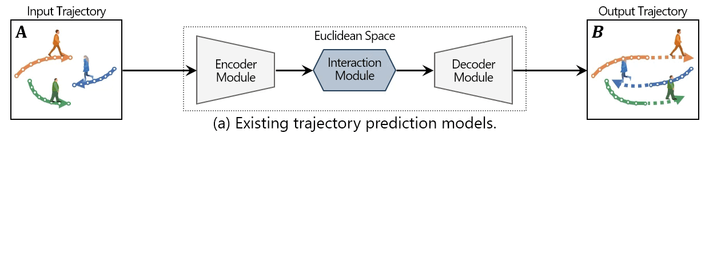
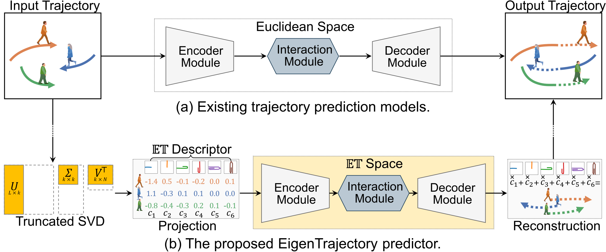

<!--## EigenTrajectory: Low-Rank Descriptors for Multi-Modal Trajectory Forecasting-->
<h2 align="center">EigenTrajectory:&thinsp;Low&hairsp;&#x0335;&hairsp;Rank&thinsp;Descriptors&thinsp;for&thinsp;Multi&hairsp;&#x0335;&hairsp;Modal&thinsp;Trajectory&thinsp;Forecasting</h2>
<p align="center">
  <a href="https://InhwanBae.github.io/"><strong>Inhwan Bae</strong></a>
  ·  
  <a href="https://www.cs.cmu.edu/~./jeanoh/"><strong>Jean Oh</strong></a>
  ·
  <a href="https://scholar.google.com/citations?user=Ei00xroAAAAJ"><strong>Hae-Gon Jeon</strong></a>
  <br>
  ICCV 2023
</p>

<p align="center">
  <a href="https://inhwanbae.github.io/publication/eigentrajectory/"><strong><code>Project Page</code></strong></a>
  <a href="https://arxiv.org/abs/2307.09306"><strong><code>ICCV Paper</code></strong></a>
  <a href="https://github.com/InhwanBae/EigenTrajectory"><strong><code>Source Code</code></strong></a>
  <a href="#-citation"><strong><code>Related Works</code></strong></a>
</p>

<div align='center'>
  <br>
  <!---->
  <br>A common pipeline of trajectory prediction models and the proposed EigenTrajectory.
</div>

<br>This repository contains the code for the EigenTrajectory(𝔼𝕋) space applied to the 10 traditional Euclidean-based trajectory predictors.
<br>EigenTrajectory-LB-EBM achieves ADE/FDE of 0.21/0.34 while requiring only 1 hour for training! 

<br>

## 🌌 EigenTrajectory(𝔼𝕋) Space 🌌
* A novel trajectory descriptor based on Singular Value Decomposition (SVD), provides an alternative to traditional methods.
* It employs a low-rank approximation to reduce the complexity and creates a compact space to represent pedestrian movements.
* A new anchor-based refinement method to effectively encompass all potential futures.
* It can significantly improve existing standard trajectory predictors by simply replacing the Euclidean space.

<br>

## Model Training
### Setup
**Environment**
<br>All models were trained and tested on Ubuntu 18.04 with Python 3.7 and PyTorch 1.12.1 with CUDA 11.1.

**Dataset**
<br>Preprocessed [ETH](https://data.vision.ee.ethz.ch/cvl/aem/ewap_dataset_full.tgz) and [UCY](https://graphics.cs.ucy.ac.cy/research/downloads/crowd-data) datasets are included in this repository, under `./datasets/`. 
The train/validation/test splits are the same as those fond in [Social-GAN](https://github.com/agrimgupta92/sgan).

You can also download the dataset by running the following script.
```bash
./scripts/download_datasets.sh
```

**Baseline models**
<br>This repository supports 10 baseline models: 
[**AgentFormer**](https://arxiv.org/abs/2103.14023), 
[**DMRGCN**](https://ojs.aaai.org/index.php/AAAI/article/view/16174), 
[**GPGraph-SGCN**](https://arxiv.org/abs/2207.09953), 
[**GPGraph-STGCNN**](https://arxiv.org/abs/2207.09953), 
[**Graph-TERN**](https://ojs.aaai.org/index.php/AAAI/article/view/25759), 
[**Implicit**](https://arxiv.org/abs/2203.03057), 
[**LBEBM**](https://arxiv.org/abs/2104.03086), 
[**PECNet**](https://arxiv.org/abs/2004.02025), 
[**SGCN**](https://arxiv.org/abs/2104.01528) and 
[**Social-STGCNN**](https://arxiv.org/abs/2002.11927). 
We have included model source codes from their official GitHub in the `./baselines/` folder. 

If you want to add your own baseline model, simply paste the model code into the baseline folder and add a few lines of [initialization constructor](https://github.com/InhwanBae/EigenTrajectory/blob/main/baseline/pecnet/__init__.py) and [bridge](https://github.com/InhwanBae/EigenTrajectory/blob/main/baseline/pecnet/bridge.py) code.

### Train EigenTrajectory
To train our EigenTrajectory on the ETH and UCY datasets at once, we provide a bash script `train.sh` for a simplified execution.
```bash
./scripts/train.sh
```
We provide additional arguments for experiments: 
```bash
./scripts/train.sh -t <experiment_tag> -b <baseline_model> -c <config_file_path> -p <config_file_prefix> -d <space_seperated_dataset_string> -i <space_seperated_gpu_id_string>

# Supported baselines: agentformer, dmrgcn, gpgraphsgcn, gpgraphstgcnn, graphtern, implicit, lbebm, pecnet, sgcn, stgcnn
# Supported datasets: eth, hotel, univ, zara1, zara2

# Examples
./scripts/train.sh -b sgcn -d "hotel" -i "1"
./scripts/train.sh -b agentformer -t EigenTrajectory -d "zara2" -i "2"
./scripts/train.sh -b pecnet -c ./config/ -p eigentrajectory -d "eth hotel univ zara1 zara2" -i "0 0 0 0 0"
```
If you want to train the model with custom hyper-parameters, use `trainval.py` instead of the script file.
```bash
python trainval.py --cfg <config_file_path> --tag <experiment_tag> --gpu_id <gpu_id> 
```

<br>

## Model Evaluation
### Pretrained Models
We provide pretrained models in the [**release section**](https://github.com/InhwanBae/EigenTrajectory/releases/tag/v1.0). 
You can download all pretrained models at once by running the script. This will download the 10 EigenTrajectory models.
```bash
./scripts/download_pretrained_models.sh
```

### Evaluate EigenTrajectory
To evaluate our EigenTrajectory at once, we provide a bash script `test.sh` for a simplified execution.
```bash
./scripts/test.sh -t <experiment_tag> -b <baseline_model> -c <config_file_path> -p <config_file_prefix> -d <space_seperated_dataset_string> -i <space_seperated_gpu_id_string>

# Examples
./scripts/test.sh -b sgcn -d "hotel" -i "1"
./scripts/test.sh -b agentformer -t EigenTrajectory -d "zara2" -i "2"
./scripts/test.sh -b pecnet -c ./config/ -p eigentrajectory -d "eth hotel univ zara1 zara2" -i "0 0 0 0 0"
```

If you want to evaluate the model individually, you can use `trainval.py` with custom hyper-parameters. 
```bash
python trainval.py --test --cfg <config_file_path> --tag <experiment_tag> --gpu_id <gpu_id> 
```

<br>

## 📖 Citation
If you find this code useful for your research, please cite our trajectory prediction papers :)

[**`💬 LMTrajectory (CVPR'24) 🗨️`**](https://github.com/InhwanBae/LMTrajectory) **|**
[**`1️⃣ SingularTrajectory (CVPR'24) 1️⃣`**](https://github.com/InhwanBae/SingularTrajectory) **|**
[**`🌌 EigenTrajectory (ICCV'23) 🌌`**](https://github.com/InhwanBae/EigenTrajectory) **|** 
[**`🚩 Graph‑TERN (AAAI'23) 🚩`**](https://github.com/InhwanBae/GraphTERN) **|**
[**`🧑‍🤝‍🧑 GP‑Graph (ECCV'22) 🧑‍🤝‍🧑`**](https://github.com/InhwanBae/GPGraph) **|**
[**`🎲 NPSN (CVPR'22) 🎲`**](https://github.com/InhwanBae/NPSN) **|**
[**`🧶 DMRGCN (AAAI'21) 🧶`**](https://github.com/InhwanBae/DMRGCN)

```bibtex
@inproceedings{bae2023eigentrajectory,
  title={EigenTrajectory: Low-Rank Descriptors for Multi-Modal Trajectory Forecasting},
  author={Bae, Inhwan and Oh, Jean and Jeon, Hae-Gon},
  booktitle={Proceedings of the IEEE/CVF International Conference on Computer Vision},
  year={2023}
}
```
<details>
  <summary>More Information (Click to expand)</summary>

```bibtex
@inproceedings{bae2024lmtrajectory,
  title={Can Language Beat Numerical Regression? Language-Based Multimodal Trajectory Prediction},
  author={Bae, Inhwan and Lee, Junoh and Jeon, Hae-Gon},
  booktitle={Proceedings of the IEEE/CVF Conference on Computer Vision and Pattern Recognition},
  year={2024}
}

@inproceedings{bae2024singulartrajectory,
  title={SingularTrajectory: Universal Trajectory Predictor Using Diffusion Model},
  author={Bae, Inhwan and Park, Young-Jae and Jeon, Hae-Gon},
  booktitle={Proceedings of the IEEE/CVF Conference on Computer Vision and Pattern Recognition},
  year={2024}
}

@article{bae2023graphtern,
  title={A Set of Control Points Conditioned Pedestrian Trajectory Prediction},
  author={Bae, Inhwan and Jeon, Hae-Gon},
  journal={Proceedings of the AAAI Conference on Artificial Intelligence},
  year={2023}
}

@inproceedings{bae2022gpgraph,
  title={Learning Pedestrian Group Representations for Multi-modal Trajectory Prediction},
  author={Bae, Inhwan and Park, Jin-Hwi and Jeon, Hae-Gon},
  booktitle={Proceedings of the European Conference on Computer Vision},
  year={2022}
}

@inproceedings{bae2022npsn,
  title={Non-Probability Sampling Network for Stochastic Human Trajectory Prediction},
  author={Bae, Inhwan and Park, Jin-Hwi and Jeon, Hae-Gon},
  booktitle={Proceedings of the IEEE/CVF Conference on Computer Vision and Pattern Recognition},
  year={2022}
}

@article{bae2021dmrgcn,
  title={Disentangled Multi-Relational Graph Convolutional Network for Pedestrian Trajectory Prediction},
  author={Bae, Inhwan and Jeon, Hae-Gon},
  journal={Proceedings of the AAAI Conference on Artificial Intelligence},
  year={2021}
}
```
</details>

### Acknowledgement
Part of our code is borrowed from [AgentFormer](https://github.com/Khrylx/AgentFormer), [DMRGCN](https://github.com/InhwanBae/DMRGCN), [GP-Graph](https://github.com/InhwanBae/GPGraph), [Graph-TERN](https://github.com/InhwanBae/GraphTERN), [Implicit](https://github.com/abduallahmohamed/Social-Implicit), [LB-EBM](https://github.com/bpucla/lbebm), [PECNet](https://github.com/HarshayuGirase/Human-Path-Prediction/tree/master/PECNet), [SGCN](https://github.com/shuaishiliu/SGCN/tree/0ff25cedc04852803787196e83c0bb941d724fc2) and [Social-STGCNN](https://github.com/abduallahmohamed/Social-STGCNN/tree/ebd57aaf34d84763825d05cf9d4eff738d8c96bb).
We thank the authors for releasing their code and models.

<br>
